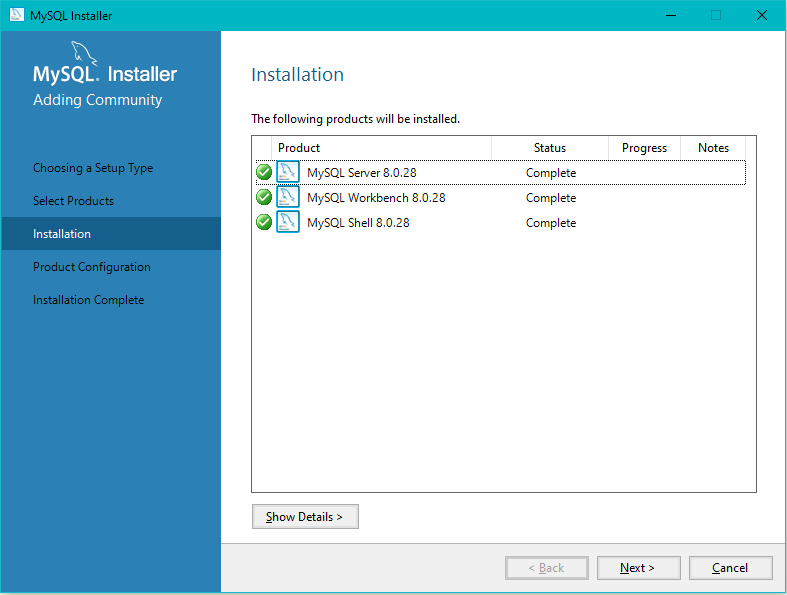

#Set up for the project

## Java

* Click [here](https://adoptium.net/) to open the Adoptium website

    * Click download
    * Run installer
      * Select to add `JAVA_HOME` variable

<i>(Note) that every version of JDK that supports Java 11 is equally good</i>

To see if it was installed correctly run:

```bash 
java --version
```

##Node and NPM

* Download Node from [here](https://nodejs.org/en/download/).
* Select `16.14.2 LTS`
* Run installer

To see if it was installed correctly run:

```bash 
npm --version
node --version
```

##MySQL

* Download MySQL from [here](https://dev.mysql.com/downloads/installer/)
* Click `Windows (x86, 32-bit), MSI Installer`
* Open the installer and in the installation type click `custom`
* Select the options as shown in the picture below



`MySQL Server` is for running the server, `MySQL Workbench` is an IDE for 
making quick queries and connecting to the server and `MySQL Shell` for a 
command line interface for MySQL

##Intellij

* Download Intellij from [here](https://www.jetbrains.com/idea/download/#section=windows)
* Select ultimate edition